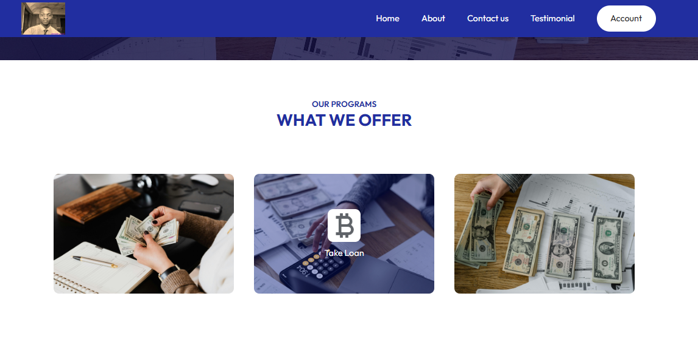
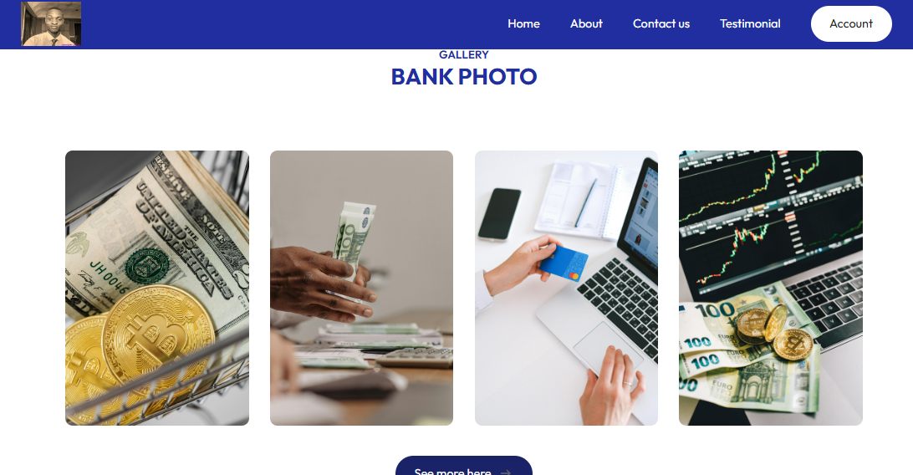
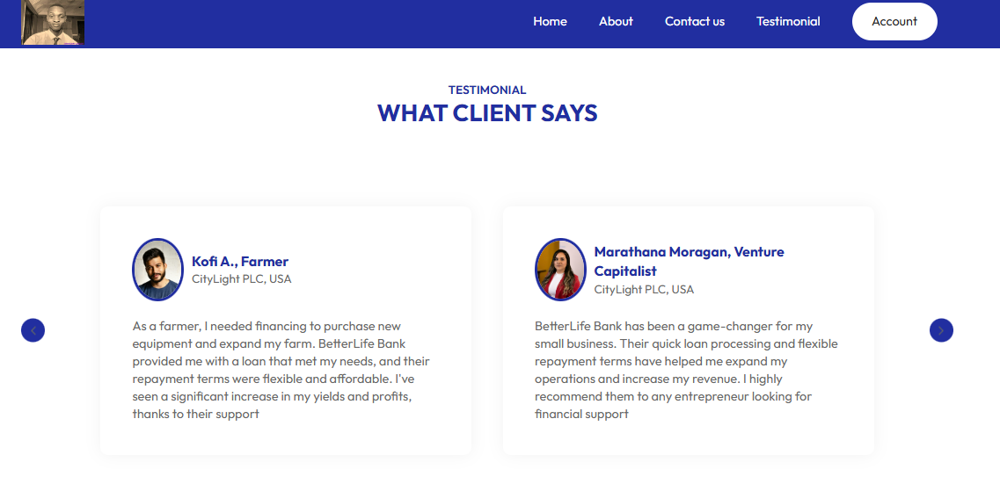

# TechBridge Instagram Clone Project


## About the Project

This repository contains the frontend capstone project for the **Techbridge Program**. The project is a clone of Instagram's **post and profile pages**, built with **React**, **JavaScript**, and **CSS**. 

The goal of this project was to learn and apply frontend development skills by creating a functional social media clone. 


---

## Technologies Used

- **React**: For building reusable components and managing application state.
- **CSS**: Styling and layout design.

---

## Installation

1. Clone the repository:

   ```bash
   git clone https://github.com/yourusername/instagram-clone.git
   ```

2. Navigate to the project directory:

   ```bash
   cd instagram-clone
   ```

3. Install dependencies:

   ```bash
   npm install
   ```

4. Start the development server:

   ```bash
   npm start
   ```

---

## Usage

- Navigate to the application in your web browser (usually [http://localhost:3000](http://localhost:3000)).
- Interact with the post feed and profile pages.

---

## Screenshots

 
 
 
 

---


 


---
